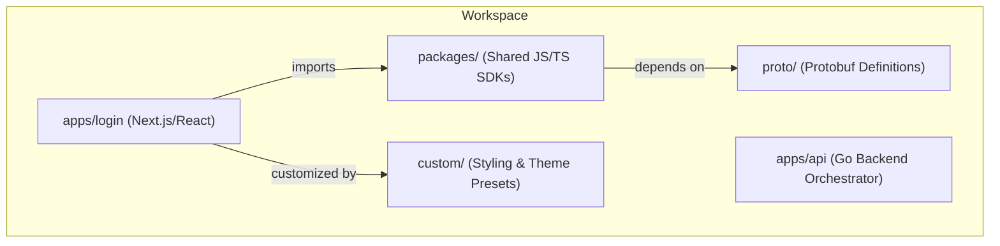

# Architecture Overview

This document provides a topology and overview of the workspace to guide AI coding agents.

## 1. Workspace Topology

This repository is structured as a **monorepo** utilizing **pnpm workspaces** and **Nx** for task coordination. It is configured as a **sparse-checkout** of the upstream [ZITADEL](https://github.com/zitadel/zitadel) project, focusing exclusively on building a customizable login application container.

### Components:
- **`apps/login`**: The primary workspace component. A Next.js application representing the ZITADEL user authentication portal. Uses TailwindCSS, custom theme logic, and connects to the ZITADEL API backend.
- **`apps/api`**: Represents the entry point for Go backend execution. In this sparse checkout, its primary use is triggering proto installations and builds rather than hosting active Go domain logic.
- **`packages/`**: Shared libraries:
  - `packages/zitadel-proto` (`@zitadel/proto`): TypeScript type bindings generated from protobuf definitions.
  - `packages/zitadel-client` (`@zitadel/client`): Authentication client library built on the generated types.
- **`proto/`**: Service schemas and API contracts that define request/response shapes.
- **`custom/`**: Contains resources for styling customizations, specifically `custom.scss` and theme presets like `custom-theme.env`.

---

## 2. Theming & Styling System

The login portal features an environment-driven styling and layout system defined in [THEME_ARCHITECTURE.md](file:///home/ndejong/cyberco/projects/psaintelligence-platform/zitadel-login/apps/login/THEME_ARCHITECTURE.md).

Key characteristics of this system include:
- **Variables**: Parsed at runtime/build-time using `NEXT_PUBLIC_THEME_*` env vars.
- **CSS Inject**: Injected class names mapping roundness presets (`edgy`, `mid`, `full`), layouts (`side-by-side`, `top-to-bottom`), and appearance style guides (`flat`, `material`).
- **SCSS Customization**: The `custom/custom.scss` stylesheet allows direct overrides of Zitadel's standard style definitions.

---

## 3. Containerization and Local Development

Local development uses Docker Compose (`docker-compose-dev.yml`) to orchestrate containerized execution:
- **Docker Volumes**: Maps the package manager store (`/pnpm/store`) and local `node_modules` folders to host volume mounts to avoid permission issues and avoid local-node pollution across OS boundaries.
- **Production Build**: Production deployment targets a Docker image built using `apps/login/Dockerfile` that builds and compiles the Next.js application into a lightweight runtime.
